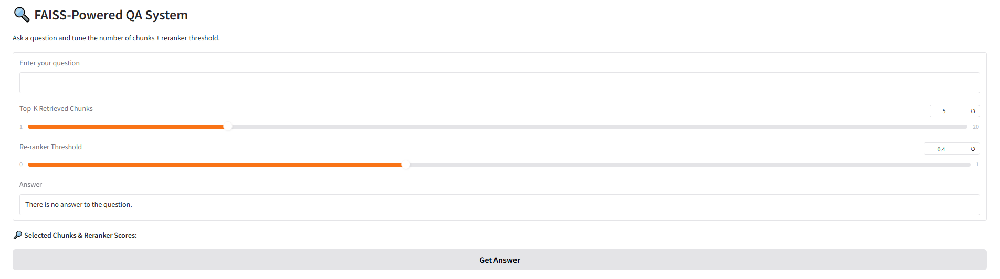

## 🧠 Retrieval-Augmented QA Pipeline (RAG) 
## Using FAISS + Azure OpenAI

This project implements a fully local **RAG system** that:
- Extracts structured chunks from `.docx` documents
- Indexes them using FAISS Vector Database
- Re-ranks results using a cross-encoder
- Generates answers using Azure OpenAI (GPT-3.5-Turbo)
- Supports a Gradio UI for interactive querying

---

## 🚀 Setup Instructions

### ✅ Step 1: Set Up Python Environment (Python 3.12.3)

#### a. Create and activate a virtual environment:  
- python -m venv venv

#### b. Activate the venv:  
- source venv/bin/activate  

#### c. allow local script execution:  
- Set-ExecutionPolicy -Scope Process -ExecutionPolicy Bypass  

#### d. Then activate again:  
- source venv/bin/activate  

### ✅ Step 2: Install PyTorch (CPU version)
pip install torch torchvision torchaudio --index-url https://download.pytorch.org/whl/cpu

### ✅ Step 3: Install Other Dependencies
pip install -r `requirements.txt`

### 🧩 Project Structure
.  
├── `faiss_client.py`       # Handles .docx parsing, chunking, and FAISS indexing  
├── `qa_pipeline.py`         # Full RAG pipeline: retrieval, reranking, prompt, and LLM answer  
├── `gradio_app.py`          # Gradio interface for querying the system  
├── `data_files/`            # Folder with your input Word documents (*.docx)  
├── `faiss_index.index`      # Saved FAISS vector index (auto-generated)  
├── `faiss_metadata.json`    # Metadata for each indexed chunk (auto-generated)  
└── `requirements.txt`

## 🛠️ Running the System

### 🔹 1. Build the FAISS Index
#### Run the FAISS indexer to process your .docx files and save the index:
RUN: `python faiss_client.py`

##### This will:  
- Chunk all `.docx` files in ./word_files/  
- Create `faiss_index.index` and `faiss_metadata.json` 

### 🔹 3. Launch the Gradio UI
RUN: `python gradio_app.py`  

#### This will start a local Gradio server and display a link like:  
Running on local URL: `http://127.0.0.1:7860`

Open the URL in your browser. You’ll see the following interface:
<!-- images/Gradio.png -->

##  🎛️ How to Use the Interface
1. Enter your question in the textbox labeled “Enter your question”.

2. Adjust:

- Top-K Retrieved Chunks: Number of chunks to retrieve from the FAISS vector DB.

- Re-ranker Threshold: Only chunks with a re-ranker score above this value will be kept.

3. Click “Get Answer” and wait a few seconds.

4. The final answer will appear, along with a detailed breakdown of the selected chunk, their scores and metadata.

#### This dynamic setup allows fine control over both the retrieval and re-ranking steps in your RAG pipeline.
